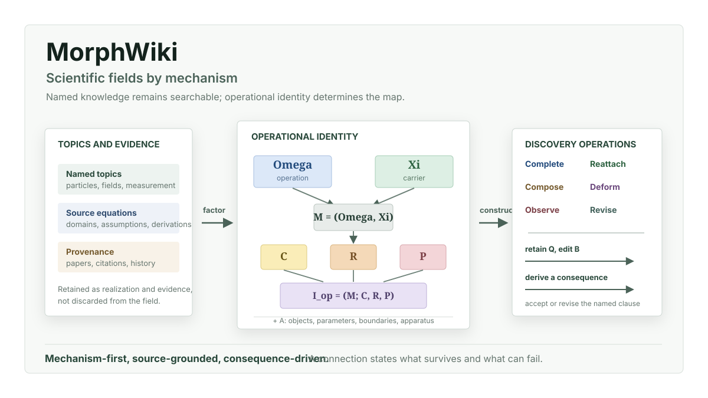

# MorphWiki

Quantum theories differ in what they treat as physical. A geometry can remain a
fixed background or become a quantum degree of freedom. An environment can be
discarded or retained as memory. A detector can record an outcome or enter the
dynamics that produces it. MorphWiki organizes a field by these changes of
physical role.



## Predictive Closure

A theory at a chosen resolution must satisfy two conditions. Its declared state
must determine later observable probabilities, and equivalent physical
transformations must compose to the same result:

```math
q(h_1)=q(h_2)
\Longrightarrow
p(y,t\mid h_1)=p(y,t\mid h_2),
\qquad
T_{\gamma_1}=T_{\gamma_2}.
```

The first condition fails when discarded correlations influence the future.
Restoring them produces an internal state coordinate or a memory kernel. The
second fails when a closed sequence retains path information. Restoring global
consistency produces curvature, frustration, a boundary contribution, or
another compatibility term. Both failures identify information missing from
the smaller theory.

This gives one principle for theory construction:

> Enlarge the physical description by the smallest field, state coordinate,
> operator, closure condition, observable, or protocol that makes predictions
> single-valued and transformations compositionally consistent.

## Physical Roles

A realized mechanism is written as

```math
(\Omega,\Xi)\longrightarrow M\longrightarrow
I_{\mathrm{op}}=(M;C,R,P)\longrightarrow
I_{\mathrm{real}}=(I_{\mathrm{op}};A).
```

A physical state `q` belongs to the admissible state space `Xi`. The operation
`Omega` acts on that state as a generator, channel, projection, constraint, or
observable. Their pair `M=(Omega,Xi)` specifies which law acts on which degrees
of freedom. Closure `C` fixes domains and admissibility. The map `R` produces an
observable prediction, and `P` fixes the order of preparation, control, and
measurement. The realization `A` supplies the fields, material, geometry,
parameters, initial data, and apparatus of a particular experiment.

Each role removes a physical ambiguity. Without `Xi`, the operator has no
domain. Without `C`, its states or probabilities need not be admissible. Without
`R`, formal evolution gives no predicted measurement. Without `P`, the order of
noncommuting operations is undefined.

## Role Promotion

A parameter remains in the realization while it selects a member of a fixed
theory. It enters the mechanism when it changes the state space, operator
domain, dynamical map, closure, observable, or operation order.

| Physical change | Promotion | Consequence |
| --- | --- | --- |
| A prescribed background becomes a fluctuating field | `A -> (Xi, Omega)` | Quanta, correlations, and back-reaction enter the theory |
| Geometry becomes a quantum degree of freedom | `A -> (Xi, Omega)` | Areas, connections, or causal relations acquire spectra and fluctuations |
| Environmental correlations influence later motion | `A -> (Xi, Omega, C)` | Hidden state or a memory kernel restores the reduced dynamics |
| A detector participates in the interaction | `A -> (Xi, Omega, R)` | Back-action and conditional state change enter outcome probabilities |
| A boundary selects an operator domain | `A -> (C, Omega)` | Spectra, scattering channels, and edge states change |
| Gauge or exchange symmetry selects physical states | `C -> Xi` | Charges, statistics, and admissible observables follow from the surviving sector |
| A subsystem split defines locality | `A -> (Xi, C)` | Entanglement and Bell correlations become properties of the joint state |
| An ordered control sequence defines the implemented map | `P -> Omega` | Reordering gates or measurements changes the channel |
| Effective couplings depend on observation scale | `A -> (Omega, C)` | Renormalization flow connects effective laws and fixed points |

These promotions connect subjects that are usually taught separately. Quantum
field theory promotes fields into operator-valued degrees of freedom. Open
quantum dynamics promotes environmental correlations into retained state or
memory. Measurement theory promotes apparatus coupling into a quantum
instrument. Quantum information promotes ordered protocols into channels.
Quantum gravity asks whether geometry itself must be promoted.

## Transfer And Missing Physics

A transformation between two mechanisms names the amplitude, expectation
value, algebra, current, or probability law that should remain invariant. State
and output maps `alpha` and `beta` define the compatibility residual

```math
\Delta_{\alpha,\beta}=\Omega_B\alpha-\beta\Omega_A.
```

`Delta=0` identifies another realization of the retained mechanism when the
stated observables also agree. A reproducible nonzero residual can instead
acquire its own closure and observable consequence. It then becomes a candidate
field, interaction, boundary term, memory coordinate, or correction to the law.
Thus the same calculation tests whether a mechanism transfers and identifies
the physics required when it does not.

MorphWiki expresses these calculations through six physical operations:

```text
complete    derive a missing closure, observable, or operation order
reattach    place a law on another state space through explicit maps
compose     join supported transformations
deform      vary a boundary, scale, parameter, or representation
observe     derive the measurement that distinguishes the construction
revise      replace the physical role identified by a failed consequence
```

## Quantum Theory Through Physical Roles

The first complete field build contains 146 quantum topics and 42 worked
physical mechanisms. Its opening synthesis develops the same concepts used in
the accompanying paper: predictive closure, transfer between realizations, and
the promotion of a structured incompatibility into additional physics.
Entanglement is placed with composite state structure; commutators with
observable algebra; Bell experiments with local measurement of joint states;
boundaries with operator domains; and gauge constraints with the physical
Hilbert space. The gauge, decoherence, entanglement, commutator, renormalization,
and fermion chapters give the principal equation-level examples.

Current book:
[Quantum Theory Through Physical Roles](discoveries/morphwiki_quantum/book/quantum_mechanism_tree_book.pdf)

## Source Equations

A source pointer is published only after a topic-bearing local equation context
has been joined to its exact V2.1 source-card alignment. The six central
mechanisms are held to a stricter condition: the local context must also name
the defining relation, such as anticommutation for fermions, field strength for
gauge theory, or a reduced-state equation for decoherence. Candidate identifiers
alone never become citations.

```bash
MORPHWIKI_V2_ROOT=/path/to/KnowledgeParser/discoveries \
MORPHWIKI_V2_SOURCE_CARD_ALIGNMENT_JSONL=/path/to/KnowledgeParser/discoveries/operator_substrate_v2_full_v21_source_card_alignment.jsonl \
MORPHWIKI_V2_SOURCE_CARDS_JSONL=/path/to/KnowledgeParser/discoveries/source_equation_cards_full_v21.jsonl \
bash scripts/run_quantum_book.sh
```

On a machine containing the full V2.1 artifacts, the complete evidence and book
build is:

```bash
KNOWLEDGE_PARSER_DISCOVERIES=/path/to/KnowledgeParser/discoveries \
bash scripts/run_quantum_book_v21_full.sh
```

For a detached overnight run:

```bash
mkdir -p logs
setsid env KNOWLEDGE_PARSER_DISCOVERIES=/path/to/KnowledgeParser/discoveries \
  ./scripts/run_quantum_book_v21_full.sh \
  > logs/quantum_book_v21_full.log 2>&1 < /dev/null &
```

## Quick Start

The deterministic build uses the Python standard library. XeLaTeX or LuaLaTeX
is required for the PDF.

```bash
git clone https://github.com/synthetix-institute/morphwiki.git
cd morphwiki
bash scripts/run_quantum_book.sh
```

Outputs are written to `discoveries/morphwiki_quantum/`.

## Repository Map

```text
scripts/morphwiki_constructor.py
    Predictive closure, physical roles, role promotions, and constructor operations.

scripts/build_morphwiki_quantum_tree.py
    Assign quantum topics to physical roles and export promotion metadata.

scripts/build_morphwiki_v2_quantum_evidence_index.py
    Match topic relations to source equations from the full V2.1 export.

scripts/analyze_quantum_constructor_rewiring.py
    Derive transformations that preserve a named quantum relation.

scripts/build_morphwiki_quantum_book.py
    Generate the LaTeX book and topic derivations.

scripts/run_quantum_book.sh
    Rebuild the evidence index, quantum map, book, PDF, and reproduction report.

scripts/run_quantum_book_v21_full.sh
    Require the full V2.1 source cards and alignments, then run the complete build.

discoveries/morphwiki_quantum/
    Quantum map, role promotions, topic pages, equation evidence, and book.
```

## Building Another Field

The same upper-level identity applies to another field, but its physical roles
must be inferred from its equations and source-local transformations.

```text
1. Retain each equation with its paper and local context.
2. Identify the state space, operation, closure, observable, protocol, and realization.
3. Find quantities whose physical role changes across theories.
4. State the relation retained by each transformation.
5. Compute the compatibility residual.
6. Complete an exact transfer or promote a structured residual.
7. Derive an observable consequence in the target realization.
```

The formal requirements are described in
[FIELD_WIKI_CONTRACT.md](docs/FIELD_WIKI_CONTRACT.md), and the reproducible
workflow begins in [Getting Started](docs/GETTING_STARTED.md).

## Contribution Standard

A contribution should supply at least one of the following:

1. a source equation with its physical roles identified;
2. a transformation with a stated invariant relation;
3. a role promotion that changes an independent observable;
4. a physical realization with parameters, boundaries, and a discriminating measurement;
5. a reproducible field build from a source corpus.

Broader Hyperion and FieldBridge work is maintained by the
[Synthetix Institute](https://synthetix.institute).
