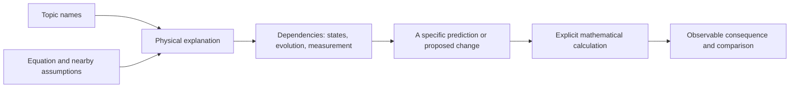

# MorphWiki

**Explain a field through the equations needed to predict an experiment.**

[Tutorial](docs/tutorial/index.md) · [Quantum book](discoveries/morphwiki_quantum/book/quantum_mechanism_tree_book.pdf) · [Worked calculation](docs/tutorial/08_quantum_construction.md) · [Build from papers](docs/tutorial/06_new_field.md)

Predicting the magnetization of one interacting spin can require a correlation
with a second spin. The state space, Hamiltonian, correlation and measurement
then belong to one calculation, even though a topic-based account may discuss
them in separate chapters. MorphWiki organizes quantum theory around such
dependencies and keeps familiar topic names as entry points.

The repository produces a navigable field map and an explanatory book. A
separate calculation companion uses [FieldBridge](https://github.com/synthetix-institute/fieldbridge)
to derive consequences of explicit equations. The book provides the physical
connections; the companion makes selected constructions executable.

## Begin with a prediction

For two spins with interaction $H=gZ\otimes Z$, let $x(t)$ be the transverse
magnetization of the first spin and $c(t)$ its correlation
$\langle Y\otimes Z\rangle$ with the second. In units with $\hbar=1$,

```math
\dot x=-2g c,\qquad \dot c=2g x,
\qquad
x(t)=x(0)\cos(2gt)-c(0)\sin(2gt).
```

Two preparations with the same $x(0)$ can give different later signals.
The Hamiltonian determines which additional expectation value is needed.
The companion finds this closed pair by repeated commutators; its input
contains the Hamiltonian and measured operator, not the answer.

### Run the companion

Keep the repositories next to each other:

```text
work/
  fieldbridge/
  morphwiki/
```

From `morphwiki/`, using Python 3.10 or newer:

```bash
python3 -m venv .venv
source .venv/bin/activate
python3 -m pip install -e '../fieldbridge[construction]'
python3 -B scripts/build_construction_companion.py \
  --fieldbridge-root ../fieldbridge --out-dir build/construction_companion
```

Open `build/construction_companion/README.md`. A successful run reports
`status: complete` and three calculations:

| Calculation | Result to inspect |
| --- | --- |
| Affine stochastic coordinate change | The generator transforms with no extra Itô drift |
| Squared stochastic coordinate | A required drift is derived; omitting it leaves residual 1 |
| Interacting spins | Two observables close exactly under the Hamiltonian |

These known examples demonstrate and test the method. The command runs locally,
needs no LLM or TeX installation, and leaves the quantum book unchanged.
[Understand the outputs](docs/tutorial/10_submission_companion.md).

### Solve for interactions

An optional fourth example asks which Ising couplings allow exchange and
collective phase evolution to separate when the exchange strengths vary.
The constructor solves the coupling equations, predicts an end-spin
cancellation, checks full Hamiltonian evolution, and repeats the design with
nearest-neighbour Ising interactions:

```bash
python3 -B scripts/build_construction_companion.py \
  --fieldbridge-root ../fieldbridge --include-spin-design \
  --out-dir build/construction_companion_with_design
```

[Follow the inverse construction](docs/tutorial/11_inverse_construction.md).
This is a runnable method example using known collective-spin physics. The
coupling constraint is calculated; physical novelty is not presumed.

## Why organize a book this way?

The Hilbert space determines which states and operators exist. The Hamiltonian
and its domain determine evolution. Preparation fixes the initial state, and
the measured operator determines which part of that evolution an experiment
reveals. Changing one of these choices can change what must be specified in
the others.

MorphWiki records this dependence in a nested description:

```math
M=(\Omega,\Xi),\qquad
I_{\mathrm{op}}=(M;C,R,P),\qquad
I_{\mathrm{real}}=(I_{\mathrm{op}};A).
```

Here $\Omega$ identifies an operation class and $\Xi$ its carrier.
Conditions $C$ include constitutive relations, admissibility and operator
domains; $R$ specifies the observable and $P$ the preparation and sequence
of operations. $A$ attaches a particular physical implementation.
A changed boundary or an additional dynamical degree of freedom must also
change the relevant inner description.

The roles are the organizing model of the book. Topic placement combines
curated physical assignments with scores computed from source records.
Recurring families within a representation and evidence that this particular
role partition is preferred by data are separate questions.

## Navigate the field



The [tutorial](docs/tutorial/index.md) follows a quantum example from explanation
to calculation, then shows how the repository builds and checks the source
index. It explains why observable incompatibility, state correlations and
measurement back-action play different roles.

A local equation context must pass V2.1 alignment and topic-relevance checks
before it is published as a source pointer. Candidate identifiers remain
distinct from confirmed witnesses. A successful symbolic calculation does not
fill a missing citation.

## Read, rebuild, or extend

| Goal | Start here |
| --- | --- |
| Read the book | [Quantum Theory Through Physical Roles](discoveries/morphwiki_quantum/book/quantum_mechanism_tree_book.pdf) |
| Learn the code through physics | [Guided tutorial](docs/tutorial/index.md) |
| Inspect how a topic becomes a chapter | [One mechanism page](docs/tutorial/03_mechanism_page.md) |
| Rebuild in a separate output tree | [Safe book build](docs/tutorial/05_build_and_audit.md) |
| Connect sources and calculations | [Evidence and transformations](docs/tutorial/09_sources_and_calculations.md) |
| Organize another paper collection | [New-field walkthrough](docs/tutorial/06_new_field.md) |
| Prepare a research companion | [Reproduction and submission](docs/tutorial/10_submission_companion.md) |

The deterministic quantum build uses cached records. For PDF compilation the
runner tries `latexmk/pdflatex`, `pdflatex`, `xelatex`, then `lualatex`.
Full source-grounding regeneration also needs the V2.1 source cards and
alignments. The tutorial separates that larger job from local examples.

## Where the work happens

| Source | Responsibility |
| --- | --- |
| [morphwiki_constructor.py](scripts/morphwiki_constructor.py) | Physical-role definitions and constructor operations |
| [build_morphwiki_quantum_tree.py](scripts/build_morphwiki_quantum_tree.py) | Curated and scored topic placement |
| [build_morphwiki_v2_quantum_evidence_index.py](scripts/build_morphwiki_v2_quantum_evidence_index.py) | Join local source equations to topic evidence |
| [analyze_quantum_constructor_rewiring.py](scripts/analyze_quantum_constructor_rewiring.py) | Annotate authored hypotheses with topic availability and overlap |
| [build_morphwiki_quantum_book.py](scripts/build_morphwiki_quantum_book.py) | Render explanatory chapters and LaTeX |
| [build_construction_companion.py](scripts/build_construction_companion.py) | Reproduce three FieldBridge calculations and the optional inverse interaction design |
| [build_morphwiki_field_from_pdfs.py](scripts/build_morphwiki_field_from_pdfs.py) | Build a source-indexed wiki from another collection |

## Contribute a physical connection

A useful addition starts with a question whose answer depends on more than one
topic: a boundary that changes a spectrum, a correlation required by a measured
response, or a change of coordinates that alters a stochastic drift. Supply
the equations and assumptions, explain the dependence, and calculate a
consequence. Keep source evidence and calculation together.

The [field-wiki contract](docs/FIELD_WIKI_CONTRACT.md) and
[contribution walkthrough](docs/tutorial/06_new_field.md) describe the records.
The book explains established quantum theory. A discovery candidate additionally
needs a previously unprovided consequence, a test in its target system, and
comparison with existing work.

Developed within the [Synthetix Institute](https://synthetix.institute).
