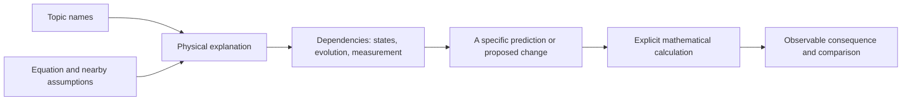

# MorphWiki

**Explain a field through the equations needed to predict an experiment.**

[Tutorial](docs/tutorial/index.md) · [Expository companion](discoveries/morphwiki_quantum/book/companion/quantum_mechanism_tree_book.pdf) · [Worked calculation](docs/tutorial/08_quantum_construction.md) · [Build from papers](docs/tutorial/06_new_field.md)

Predicting the magnetization of one interacting spin can require a correlation
with a second spin. The state space, Hamiltonian, correlation and measurement
then belong to one calculation, even though a topic-based account may discuss
them in separate chapters. MorphWiki organizes quantum theory around such
dependencies and keeps familiar topic names as entry points.

The repository produces a navigable field map and an explanatory book. A
separate calculation companion uses [FieldBridge](https://github.com/synthetix-institute/fieldbridge)
to derive consequences of explicit equations. The book provides the physical
connections; the companion makes selected constructions executable.

## A worked prediction

For two spins with interaction $H=gZ\otimes Z$, let $x(t)$ be the transverse
magnetization of the first spin and $c(t)$ its correlation
$\langle Y\otimes Z\rangle$ with the second. In units with $\hbar=1$,

```math
\dot x=-2g c,\qquad \dot c=2g x,
\qquad
x(t)=x(0)\cos(2gt)-c(0)\sin(2gt).
```

Two preparations with the same $x(0)$ can give different later signals.
The Hamiltonian determines which additional expectation value is needed.
The companion finds this closed pair by repeated commutators; its input
contains the Hamiltonian and measured operator, not the answer.

### Calculation companion

Keep the repositories next to each other:

```text
work/
  fieldbridge/
  morphwiki/
```

From `morphwiki/`, using Python 3.10 or newer:

```bash
python3 -m venv .venv
source .venv/bin/activate
python3 -m pip install -e '../fieldbridge[construction]'
python3 -B scripts/build_construction_companion.py \
  --fieldbridge-root ../fieldbridge --out-dir build/construction_companion
```

Open `build/construction_companion/README.md`. A successful run reports
`status: complete` and three calculations:

| Calculation | Result to inspect |
| --- | --- |
| Affine stochastic coordinate change | The generator transforms with no extra Itô drift |
| Squared stochastic coordinate | A required drift is derived; omitting it leaves residual 1 |
| Interacting spins | Two observables close exactly under the Hamiltonian |

These known examples demonstrate and test the method. The command runs locally,
needs no LLM or TeX installation, and leaves the quantum book unchanged.
[Understand the outputs](docs/tutorial/10_submission_companion.md).

### Interaction design

An optional fourth example asks which Ising couplings allow exchange and
collective phase evolution to separate when the exchange strengths vary.
The constructor solves the coupling equations, predicts an end-spin
cancellation, checks full Hamiltonian evolution, and repeats the design with
nearest-neighbour Ising interactions:

```bash
python3 -B scripts/build_construction_companion.py \
  --fieldbridge-root ../fieldbridge --include-spin-design \
  --out-dir build/construction_companion_with_design
```

[Follow the inverse construction](docs/tutorial/11_inverse_construction.md).
This is a runnable method example using known collective-spin physics. The
coupling constraint is calculated; physical novelty is not presumed.

## Organization by physical role

The Hilbert space determines which states and operators exist. The Hamiltonian
and its domain determine evolution. Preparation fixes the initial state, and
the measured operator determines which part of that evolution an experiment
reveals. Changing one of these choices can change what must be specified in
the others.

MorphWiki records this dependence in a nested description:

```math
M=(\Omega,\Xi),\qquad
I_{\mathrm{op}}=(M;C,R,P),\qquad
I_{\mathrm{real}}=(I_{\mathrm{op}};A).
```

Here $\Omega$ identifies an operation class and $\Xi$ its carrier. The
closure $C$ is what is specified or discarded to obtain closed equations:
constitutive relations, admissible states and operator domains, boundaries,
imposed conservation laws and eliminated degrees of freedom. $R$ specifies the
observable and $P$ the preparation and sequence of operations. $A$ is the
material or apparatus that implements the model, entered as parameter values.
A changed boundary or an additional dynamical degree of freedom must also
change the relevant inner description.

The roles are the organizing model of the book. Topic placement combines
curated physical assignments with scores computed from source records.
Recurring families within a representation and evidence that this particular
role partition is preferred by data are separate questions.

## Structure of the field map



The [tutorial](docs/tutorial/index.md) follows one quantum measurement from
two physical preparations through commutator closure, nested dependencies,
source evidence and a reproducible calculation. Book construction and other
physical topics have separate modules.

Equation citations carry an exact source-card link, a complete relation and
its local assumptions. General references selected for an explanatory
derivation are listed separately from recovered equations.
The calculation establishes consequences of its supplied inputs; citations
locate the corresponding relations in inspected sources.

The book opens with **Quantum Mechanisms And Their Predictions**, developing
an interaction, the correlation it generates, and its measured consequence
before introducing the nested description. Closure enters when the calculation
shows what information a reduced description has omitted.

The **expository companion** is the book to read. It develops all 62
topic-specific treatments and indexes all 146 subjects. The index distinguishes 63 overview entries without
an individual derivation, four alternative names, and 17 historical or
interpretive entries. Repeated branch-level equations are omitted from this
edition. The [full reference edition](discoveries/morphwiki_quantum/book/quantum_mechanism_tree_book.pdf)
is for lookup rather than reading: it gives every subject its own entry,
including overviews that repeat the equations of their chapter. Individual
topic files remain available. Two treatments previously hidden
by alternative-name redirects now appear with their equations.

The first page states the book's scope. Each treatment identifies its authored
exposition and the source routes available for particular relations;
cross-topic connections are marked as authored interpretations. Six topics
retain screened corpus-aligned equation examples. Original-paper recovery adds
16 located displays for 15 topics,
including the error-correction condition, canonical commutators, amplifier
noise constraints and quantum metrology. These displays were selected and
inspected in the original arXiv articles; their records identify
original-paper recovery separately from corpus alignment.
[Recover and inspect the sources](docs/tutorial/12_original_sources.md).
The companion supplies background exposition and can be cited as a separately
versioned accompanying work. The three calculation examples form a focused
methods supplement; discovery claims require their own target-system tests.
The local edition has no DOI.

The [companion checks](discoveries/morphwiki_quantum/book/companion/companion_integrity.md)
require all 62 treatments to retain the same bodies as the full edition, all
146 index entries to be present exactly once, and visible provenance and source
links to survive. The report counts developed treatments separately from index
entries and records the status of scientific review. See the
[correction notes](docs/QUANTUM_BOOK_CORRECTIONS.md)
for the scientific corrections and remaining review work.

## Reading, rebuilding and extending

| Goal | Start here |
| --- | --- |
| Read the companion | [Quantum Theory as a Mechanism Tree](discoveries/morphwiki_quantum/book/companion/quantum_mechanism_tree_book.pdf) |
| Look up any of the 146 subjects | [Full reference edition](discoveries/morphwiki_quantum/book/quantum_mechanism_tree_book.pdf) |
| Learn the code through physics | [Guided tutorial](docs/tutorial/index.md) |
| Inspect how a topic becomes a chapter | [One mechanism page](docs/tutorial/03_mechanism_page.md) |
| Rebuild in a separate output tree | [Safe book build](docs/tutorial/05_build_and_audit.md) |
| Connect sources and calculations | [Evidence and transformations](docs/tutorial/09_sources_and_calculations.md) |
| Organize another paper collection | [New-field walkthrough](docs/tutorial/06_new_field.md) |
| Explore other physical mechanisms | [Material-memory path](docs/tutorial/topics/index.md) |
| Reproduce the calculations | [Calculation package](docs/tutorial/10_submission_companion.md) |
| Prepare a research companion | [Submission scope](docs/tutorial/13_submission_scope.md) |

The deterministic quantum build uses cached records. For PDF compilation the
runner tries `latexmk/pdflatex`, `pdflatex`, `xelatex`, then `lualatex`.
Full source-grounding regeneration also needs the V2.1 source cards and
alignments. The tutorial separates that larger job from local examples.

To rebuild both book editions from the existing records, with Python and
`latexmk` available:

```bash
bash scripts/run_quantum_expository_companion.sh
```

This command renders both editions from the cached records and existing topic
assignments. Mathematical tests and build-integrity checks cover different
properties of the output.

The tests include exact symbolic checks of the worked mechanisms and checks
that source records survive the build:

```bash
python3 -m pip install -r requirements-dev.txt
python3 -B -m pytest -q
```

The construction-companion test also uses the standalone FieldBridge repository.
It is found automatically at `../fieldbridge`; set `FIELDBRIDGE_ROOT` when it
is elsewhere. Original-source downloads are opt-in and are not run by the tests.

## Implementation

| Source | Responsibility |
| --- | --- |
| [morphwiki_constructor.py](scripts/morphwiki_constructor.py) | Physical-role definitions and constructor operations |
| [build_morphwiki_quantum_tree.py](scripts/build_morphwiki_quantum_tree.py) | Curated and scored topic placement |
| [build_morphwiki_v2_quantum_evidence_index.py](scripts/build_morphwiki_v2_quantum_evidence_index.py) | Join local source equations to topic evidence |
| [analyze_quantum_constructor_rewiring.py](scripts/analyze_quantum_constructor_rewiring.py) | Annotate authored hypotheses with topic availability and overlap |
| [build_morphwiki_quantum_book.py](scripts/build_morphwiki_quantum_book.py) | Render explanatory chapters and LaTeX |
| [quantum_physical_derivations.py](scripts/quantum_physical_derivations.py) | Eighteen worked explanations with their equations and references |
| [recover_quantum_original_sources.py](scripts/recover_quantum_original_sources.py) | Recover selected original arXiv displays with locations and hashes |
| [build_construction_companion.py](scripts/build_construction_companion.py) | Reproduce three FieldBridge calculations and the optional inverse interaction design |
| [build_morphwiki_field_from_pdfs.py](scripts/build_morphwiki_field_from_pdfs.py) | Build a source-indexed wiki from another collection |

## Contributions

A useful addition starts with a question whose answer depends on more than one
topic: a boundary that changes a spectrum, a correlation required by a measured
response, or a change of coordinates that alters a stochastic drift. Supply
the equations and assumptions, explain the dependence, and calculate a
consequence. Keep source evidence and calculation together.

The [field-wiki contract](docs/FIELD_WIKI_CONTRACT.md) and
[contribution walkthrough](docs/tutorial/06_new_field.md) describe the records.
The book explains established quantum theory. A discovery candidate additionally
needs a previously unprovided consequence, a test in its target system, and
comparison with existing work.

Developed within the [Synthetix Institute](https://synthetix.institute).
