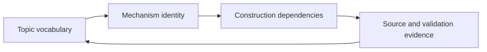

# MorphWiki Field-Wiki Contract

A MorphWiki field wiki is a source-grounded description of a scientific field
organized by mechanisms rather than historical topic order. It keeps familiar
topic names as entry points, but does not use those names as the primary
structure of knowledge.

## Three Views of One Field

Every field wiki should expose three synchronized views.

### 1. Topic View

The topic view preserves the public vocabulary of the field: names used in
Wikipedia, textbooks, reviews and source papers. It answers, “What will a
reader search for?”

### 2. Mechanism View

The mechanism view rewrites each topic as an operational contract:

```text
I_op = (M; C, R, P),    M = (Omega, Xi)
```

- `Omega`: transformation or operator apparatus;
- `Xi`: carrier, substrate or state space;
- `C`: closure and admissibility;
- `R`: observable or readout;
- `P`: intervention, preparation or protocol.

It answers, “What does this topic do in a calculation or experiment?”

### 3. Construction View

The construction view orders dependencies: which carrier must be specified
before an operator can act, which closure makes the operation legal, which
readout exposes a consequence and which protocol realizes it. It answers,
“What must already exist before this mechanism can be used?”



## Required Page Content

A field page is ready for public use when it contains:

1. the familiar topic title and source description;
2. its role in the field’s constructor;
3. carrier or domain;
4. operator or transformation;
5. closure and admissibility conditions;
6. readout and observable consequences;
7. protocol or realization where applicable;
8. representative equations;
9. what remains stable across realizations;
10. what changes with realization;
11. source links and equation witnesses;
12. an explicit unresolved status when evidence is insufficient.

## Field-Level Structure

The wiki index should not be a manually chosen list of chapters. Its candidate
constructor spine is inferred from the field corpus using route/fiber profiles,
source-local transitions and sparse-attention structure. Human-readable names
are added only after the measured roles and dependencies have been audited.

Different fields can therefore have different spines while sharing the same
upper-level contract. For example:

```text
quantum theory:
carrier -> state -> generator -> spectrum -> probability readout
        -> compatibility -> realization -> protocol

material intelligence:
material state -> stimulus coupling -> transport/relaxation
               -> interface closure -> response -> memory/erasure protocol

population biology:
population state -> interaction/growth operator -> resource closure
                 -> observable trait -> perturbation protocol
```

## Evidence Levels

MorphWiki distinguishes:

```text
placement    plausible role in the field constructor
construction sufficient equation-level clauses to state a mechanism
validation   source evidence plus formal or empirical rejection tests
```

Fluent prose cannot promote a page between these levels. Promotion requires
the missing operational evidence.

## What Makes Field Wikis Comparable

Two field wikis are connected through retained mechanism clauses, not through
similar names. A cross-field link must state what is preserved, what carrier or
completion clause changes, and what would test the proposed realization. This
allows a shared operational index without erasing field-specific knowledge.
