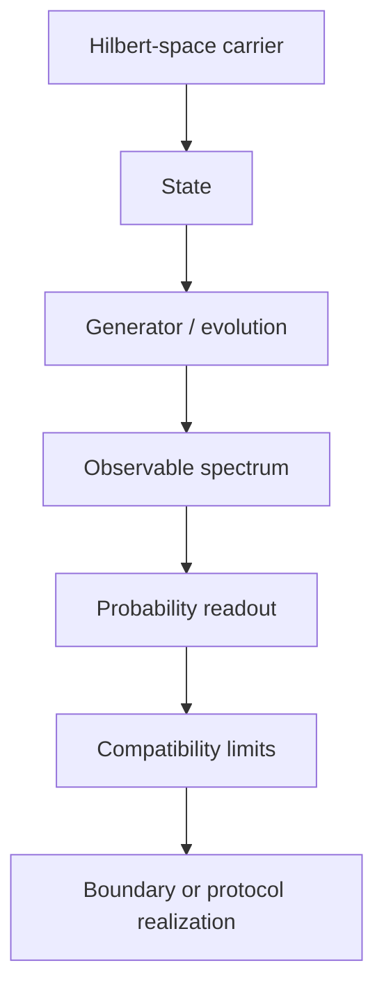

# Chapter 1: Three Views of a Scientific Field

A conventional encyclopedia organizes quantum theory through familiar nouns:
wavefunction, electron, photon, measurement and entanglement. That vocabulary
is useful for finding a topic, but it mixes objects, mathematical roles,
historical episodes and experimental realizations.

MorphWiki keeps the names and separates the views.

## Topic View

The topic view answers what a reader is likely to search for. It preserves the
Wikipedia title, description, URL and attribution.

## Mechanism View

The mechanism view asks five questions:

```text
What transforms?          Omega
What carries the change?  Xi
What makes it admissible? C
What is observed?         R
What is done?             P
```

For the Schrödinger equation, the mechanism view identifies a state carrier,
a Hamiltonian generator, domain and self-adjointness conditions, and readouts
such as time-dependent probabilities or transition amplitudes.

## Construction View

The construction view orders dependencies. A Hamiltonian cannot generate
lawful evolution until its carrier and domain are specified. A spectrum is not
a measurement until a state-to-outcome rule is attached. A named quantum
effect is often a boundary realization of this more general construction.



The three views remain linked. Topic names make the wiki usable; mechanism
roles make it comparable across fields; construction dependencies make gaps
and overloaded concepts visible.

Next: [Build the topic and evidence index](02_topic_and_evidence.md).
