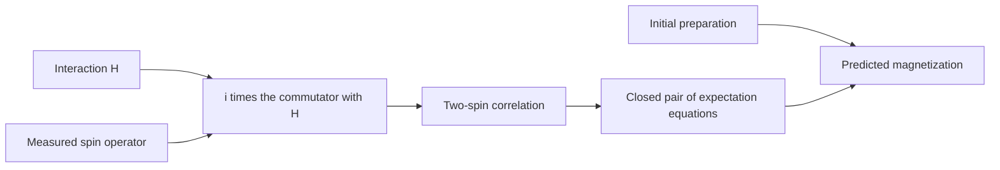

# Read one experiment through three views

A reader may enter quantum theory through the topic “spin,” through an
equation of motion, or through an experiment. MorphWiki keeps these entry
points connected. Its topic names help locate material; the mechanism
description identifies the equations and conditions; the construction view
shows why several topics are needed for one prediction.

Consider two spin-1/2 degrees of freedom with Hamiltonian
$H=gZ\otimes Z$, where $Z$ is a Pauli matrix. Suppose the experiment
measures $X\otimes I$, the transverse magnetization of the first spin.
The Heisenberg equation produces $-2gY\otimes Z$. Predicting the signal
therefore requires a two-spin correlation as well as the magnetization.

## Topic view: find the concepts

The familiar names include Hilbert space, Hamiltonian, observable, spin and
correlation. Cached topic metadata may also retain historical titles and
attribution. That metadata supports navigation; it is not the source evidence
for the physical equations.

## Mechanism view: specify the prediction

The state lives on a tensor product of two spin spaces. The Hamiltonian fixes
how observables evolve. The preparation sets their initial expectations.
The measured operator selects the signal. These are different roles in a
single mathematical problem, not five independent summaries.

## Construction view: identify what must be added

Starting from the measured operator, repeated commutators determine the
smallest invariant linear span containing it. For this interaction the span
closes after adding one correlation. A full density matrix remains a valid
description, but only two expectations are needed for this particular signal.

The [worked calculation](08_quantum_construction.md) derives that span and
compares preparations with the same initial magnetization. The
[page tutorial](03_mechanism_page.md) explains how the book should introduce
the equations that lead to it.

**Exercise.** Explain why this example links state composition, dynamics and
measurement without treating correlation and entanglement as synonyms. The
two contrasting preparations in the worked calculation are product states.

[Next: source records](02_topic_and_evidence.md) · [Tutorial](index.md)
