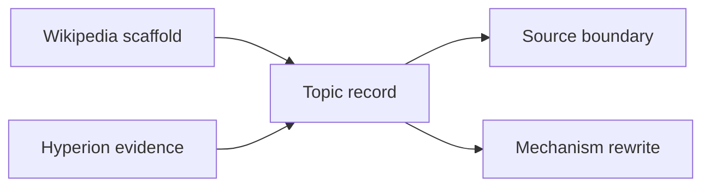

# Chapter 2: Topic Scaffold and Operational Evidence

MorphWiki begins with public topic pages but does not treat their prose as the
mechanism. Wikipedia supplies titles, summaries, links and attribution. The
Hyperion witness index supplies equation-level route and fiber evidence.

Rebuild a compact quantum topic set from the cached Wikipedia pages:

```bash
python3 -B scripts/export_morphwiki_topic_index.py \
  --topics 'Schrödinger equation,Hilbert space,Observable,Born rule,Commutator' \
  --hyperion-index discoveries/fieldbridge_static_index/hyperion_static_index.json \
  --cache-dir discoveries/morphwiki_quantum/wiki_cache \
  --out-dir build/tutorial_quantum
```

Each generated JSON record keeps the two evidence layers separate:

```text
wikipedia.title / summary / url
hyperion.route_profile
hyperion.fiber_profile
hyperion.equation_witnesses
mechanism reading and evidence boundary
```

Inspect one full record:

```bash
python3 -m json.tool \
  discoveries/morphwiki_quantum/pages/schr_dinger_equation.json | less
```

The route profile measures evidence for transport, closure, spectral
operators, boundaries, incompatibility and protocol. It is not a topic
classification. The witness links identify source equations with related
operational evidence; they do not prove that any one witness explains the
entire page.



Next: [Rewrite one topic as a mechanism](03_mechanism_page.md).
