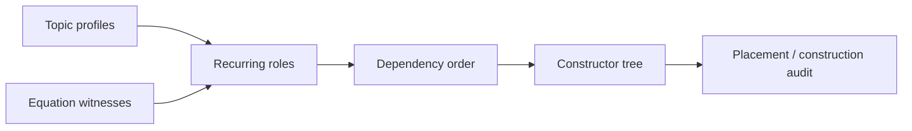

# Chapter 4: The Field Constructor

A field wiki needs more than individually rewritten pages. It needs an order
that explains how the mechanisms depend on one another. MorphWiki calls this
the **constructor spine**.

The quantum build currently resolves the following candidate spine:

```text
context and Hilbert-space carrier
-> state
-> generator and evolution
-> observable spectrum
-> probability readout
-> compatibility limit
-> boundary realization
-> many-mode extension
-> controlled protocol
```

Build the tree from the generated topic records:

```bash
python3 -B scripts/build_morphwiki_quantum_tree.py \
  --root discoveries/morphwiki_quantum \
  --out-json build/tutorial_quantum_tree.json \
  --out-md build/tutorial_quantum_tree.md
```

The spine is not chosen because it resembles a textbook table of contents.
Candidate roles and dependencies are inferred from route/fiber profiles,
equation witnesses, topic co-activation and sparse-attention structure; human
labels are attached after that evidence is inspected.



A topic can be easy to place but hard to construct. “Measurement,” for
example, belongs near readout, but a valid construction still needs a readout
map, an admissible state, an observable and an outcome rule. MorphWiki marks
that missing structure instead of hiding it inside fluent prose.

Next: [Assemble and audit the wiki](05_build_and_audit.md).
