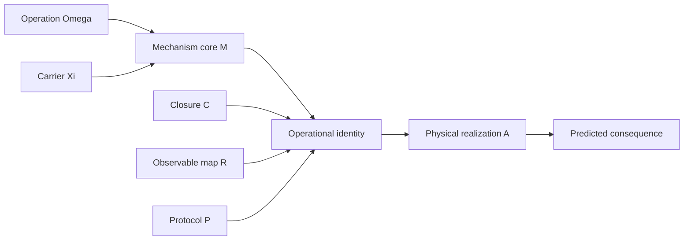

# Chapter 4: The Field Constructor

A field wiki needs more than a sequence of topics. It needs a common identity
that shows what each topic contributes and which parts can be transformed.

MorphWiki uses

```text
(Omega, Xi) -> M -> I_op=(M; C, R, P) -> I_real=(I_op; A)
```

For quantum theory:

```text
Omega   generator, observable, channel, symmetry action, projection
Xi      Hilbert/Fock space, state class, domain, factorization, algebra
C       normalization, positivity, domain, gauge, compatibility
R       spectrum, POVM, correlator, current, detector outcome
P       preparation, evolution, intervention, feedback, measurement order
A       physical system, parameters, units, boundary, device, experiment
```

This is not a linear chapter list. Carrier and operation are jointly typed.
Closure, an observable map, and protocol complete their pair. A realization turns the
operational identity into a concrete model.

Build the tree from the generated topic records:

```bash
python3 -B scripts/build_morphwiki_quantum_tree.py \
  --root discoveries/morphwiki_quantum \
  --out-json build/tutorial_quantum_tree.json \
  --out-md build/tutorial_quantum_tree.md
```



## From Structure To Discovery

A constructor edit must identify what is retained and what changes:

```text
source identity
  -> retain Q
  -> edit clause B
  -> complete the target identity
  -> attach a physical realization
  -> derive consequence y
  -> accept or revise
```

The six allowed verbs are `complete`, `reattach`, `compose`, `deform`, `observe`,
and `revise`. For example, a quantum simulator reattaches a target operator
algebra to a laboratory carrier. An encoding map must intertwine the target and
laboratory operations, and the observable map must compare a generating set of
observables or correlators. Similar state images alone do not complete the
construction.

The generated tree groups all topics by their main constructor clause. The book
then shows worked transformations before the topic chapters, so readers see how
the structure is used rather than encountering it as a final diagnostic.

Next: [Build and verify the wiki](05_build_and_audit.md).
