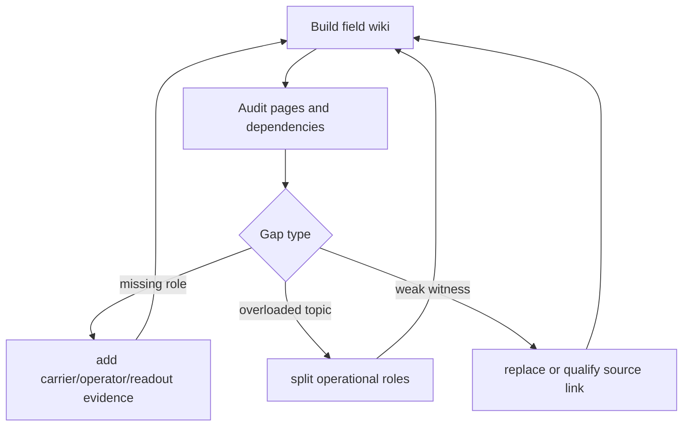

# Chapter 5: Build and Audit the Field Wiki

The standard command assembles topic records, constructor tree, diagnostics and
book:

```bash
bash scripts/run_quantum_book.sh
```

The human-readable outputs are:

```text
discoveries/morphwiki_quantum/quantum_mechanism_tree.md
discoveries/morphwiki_quantum/derivation_pages/
discoveries/morphwiki_quantum/book/quantum_mechanism_tree_book.pdf
```

The wiki must also audit itself. Sparse attention searches the generated pages
for dominant roles, overloaded junctions, weak construction and unresolved
placement:

```bash
python3 -B scripts/analyze_morphwiki_rewrite_transition.py \
  --help
```

Read the current report:

```text
discoveries/morphwiki_quantum/sparse_attention/
  morphwiki_rewrite_transition_sparse_attention.md
```

## Repair Loop



The repair target is always structural. “Improve the writing” is insufficient;
the audit should identify the missing operator, carrier, closure, readout,
protocol or source evidence.

Next: [Create another field wiki](06_new_field.md).
