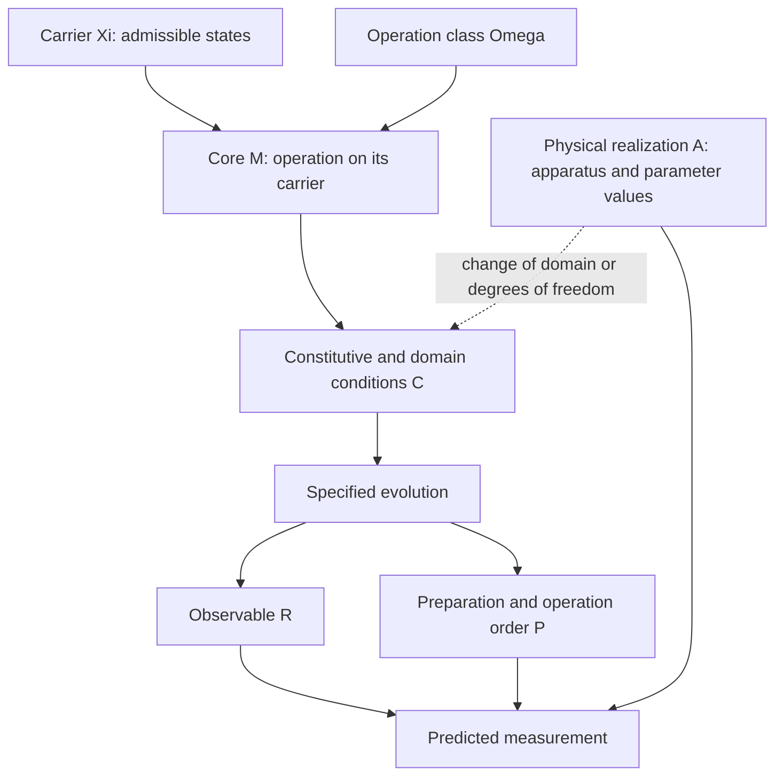

# Why a physical description has dependent levels

A quantum measurement asks for the probability of an outcome in a prepared
system. Answering it requires a state space, a state on that space, an
evolution and an observable. These choices cannot be specified independently.
A Hamiltonian acts on a particular space; a partial trace requires a declared
subsystem factorization; an observable must act on the resulting system. A
change in an earlier choice can change the meaning of the later ones.

MorphWiki records these dependencies with a core M=(Omega,Xi), followed by
conditions C, observables R and preparation or ordered operations P. A physical
realization A supplies a particular implementation. The notation is a schema
for organizing equations, not a theorem that every theory has a unique
factorization into these roles.

The diagram describes mathematical dependencies rather than the software's
execution order. The implementation defines the clauses in
[`morphwiki_constructor.py`](../../scripts/morphwiki_constructor.py). In
particular, realization is attached to a defined mechanism; a material label
does not determine the mechanism. A change of apparatus that alters the state
space or boundary condition must also change the relevant inner description.

For a spin experiment, choosing the Hilbert space fixes the possible density
matrices. Choosing the Hamiltonian then fixes how their expectation values
evolve. Specifying only the first spin's magnetization may still leave its
future undetermined if an interaction converts a two-spin correlation into
that magnetization. The needed additional quantity is obtained by applying
the Hamiltonian to the measured operator. This gives a concrete use of the
dependencies, rather than merely assigning each symbol to a category.

The archive can identify recurring families and useful transitions within
such a representation. Whether it selects this role division over alternative
feature partitions is an empirical question. The quantum book does not
resolve that question by explaining familiar theories in the supplied schema.
Its contribution is to make the resulting relationships intelligible and
available for calculation.

Continue with [the coupled-spin calculation](08_quantum_construction.md).

## What changes when the experiment changes?

For the two-spin example, the levels become concrete:

| Choice | Supplied object | Effect on the prediction |
| --- | --- | --- |
| Carrier | $\mathbb C^2\otimes\mathbb C^2$ | Defines joint states and two-spin observables |
| Dynamics | $H=gZ\otimes Z$ | Couples transverse magnetization to a correlation |
| Admissibility | Positive, unit-trace density matrices; Hermitian $H$ | Makes state probabilities and unitary evolution well defined |
| Observable | $X\otimes I$ | Selects the signal whose dynamics must close |
| Preparation | Initial expectations of $X\otimes I$ and $Y\otimes Z$ | Fixes the two initial conditions of the reduced prediction |
| Realization | A specified implementation and coupling value | Assigns an experimental time scale and measurement procedure |

Changing the measured operator to $Z\otimes I$ changes the question without
changing the Hamiltonian. That observable commutes with $H$, so its expectation
is constant and requires no extra coordinate. Adding a transverse term to $H$
instead changes the dynamics and may enlarge the required span. The same
material can therefore support different predictive descriptions depending on
the interaction and measurement.

This is the physical reason for keeping the dependencies explicit. The
constructor can ask what must be recalculated after a change rather than
replacing an entire model by analogy. The hierarchy itself supplies the places
to record those choices; the commutator calculation establishes their effect.

[Tutorial](index.md)
