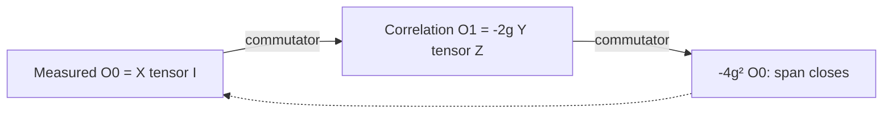

# Deriving the information needed to predict a spin

Suppose the transverse magnetization of a spin is measured while it interacts
with a second spin. A complete density matrix predicts the signal, but it may
contain much more information than this measurement requires. The construction
problem is to find the smallest closed linear set of expectation values
containing the measured one.

Let X, Y and Z be Pauli matrices, let I be the identity, and choose the
Hamiltonian H=g Z tensor Z in units with hbar=1. The measured operator is
O0=X tensor I. Its Heisenberg derivative is i[H,O0]. Evaluation of the
commutator gives a correlation between the spins:

```math
\dot O_0=-2g\,Y\otimes Z.
```

The correlation is needed because the interaction changes the transverse
magnetization at a rate that depends on it. To determine whether that
correlation introduces further unknown quantities, apply the same operation
again. Defining O1=-2g Y tensor Z gives

```math
\dot O_0=O_1,\qquad \dot O_1=-4g^2O_0.
```

No further independent operator appears. The two expectation values obey the
same closed linear system for every initial density matrix.



The return to $O_0$ is why the two-dimensional span closes. In terms of
$x(t)=\operatorname{Tr}(\rho(t)X\otimes I)$ and
$c(t)=\operatorname{Tr}(\rho(t)Y\otimes Z)$, taking initial expectations gives

```math
x(t)=x(0)\cos(2gt)-c(0)\sin(2gt).
```

This equation explains why a preparation specified only by x(0) is incomplete.
With the first spin initially along +y or -y and the second along +z, both
preparations have x(0)=0, while c(0) has opposite signs. The later measured
signals consequently have opposite signs. This example uses product states;
the missing correlation coordinate is not synonymous with entanglement.

FieldBridge derives the two-operator span from the four-dimensional Hamiltonian
and the supplied measured operator. It repeatedly evaluates commutators and
tests linear independence. It then solves for the closed evolution matrix and
verifies the operator identities. At $g=0$ the span reduces to one observable.
The calculation tests also compare the reduced result with full unitary evolution.

The underlying Heisenberg equation is standard quantum mechanics; see
[the Cambridge lecture notes](https://www.damtp.cam.ac.uk/user/tong/qm/qmhtml/S3.html).
The calculation constructs a sufficient observable set from a supplied
Hamiltonian and measurement. Its source is an authored example; the separate
[source module](09_sources_and_calculations.md) tracks recovery from papers.

## Run the calculation

```bash
python3 -m pip install -e '../fieldbridge[construction]'
python3 -B scripts/build_construction_companion.py \
  --fieldbridge-root ../fieldbridge --out-dir build/construction_companion
```

The report for this calculation is
`build/construction_companion/quantum_correlations/calculation.md`.
The associated `input.json` contains the Hamiltonian, observable and assumptions.
The same run includes an exact affine stochastic transfer and a nonlinear
transfer that requires an additional drift. Together they show both preservation
of a mechanism and derivation of a required correction.

Code: [`build_construction_companion.py`](../../scripts/build_construction_companion.py)
calls `fieldbridge.verification.quantum_closure` in the explicitly selected
sibling repository.

## Read the numerical record in physical terms

After running the companion, inspect these fields:

```bash
python3 - <<'PY'
import json
from pathlib import Path

report = json.loads(Path('build/construction_companion/quantum_correlations/calculation.json').read_text(encoding='utf-8'))
for key in ('hilbert_dimension', 'observable_dimension',
            'evolution_matrix', 'closed_identities'):
    print(key, report[key])
PY
```

Expect Hilbert dimension 4, observable dimension 2, evolution matrix
`[['0', '1'], ['-4*g**2', '0']]`, and two true identities. The matrix uses
the basis $(O_0,O_1)$, with $O_1=-2gY\otimes Z$. It therefore looks different
from the equations for $(x,c)$ but gives the same prediction. A changed basis
is not a changed interaction.

## Exercise: change what the detector measures

Keep $H$ fixed and measure $Z\otimes I$. Before running, calculate its
commutator with $H$: it is zero, so the new signal must be constant.

```bash
python3 - <<'PY'
import json
from pathlib import Path

spec = json.loads(Path('../fieldbridge/examples/construction/quantum_correlations.json').read_text(encoding='utf-8'))
spec['observable'] = [[1,0,0,0], [0,1,0,0], [0,0,-1,0], [0,0,0,-1]]
spec['question'] = 'Is the longitudinal magnetization constant for the same interaction?'
spec['assumptions'][2] = 'The observable is sigma_z tensor identity.'
spec['provenance']['origin'] = 'tutorial change of the measured observable'
spec['provenance']['equation_ids'] = ['two_spin:H', 'tutorial_longitudinal:observable']
out = Path('build/tutorial_longitudinal.json')
out.parent.mkdir(parents=True, exist_ok=True)
out.write_text(json.dumps(spec, indent=2), encoding='utf-8')
PY
python3 -B -m fieldbridge verify-construction \
  build/tutorial_longitudinal.json --out-dir build/tutorial_longitudinal
```

The expected span has dimension 1 and evolution matrix `[['0']]`.
This comparison demonstrates that predictive sufficiency depends on the
observable, not only on the material or Hamiltonian. For an exercise changing
the Hamiltonian instead, see the
[FieldBridge transverse-field construction](https://github.com/synthetix-institute/fieldbridge/blob/main/docs/tutorial/11_quantum_closure.md).

[Next: interpret the nested description](07_nested_dependencies.md) ·
[Tutorial](index.md)
