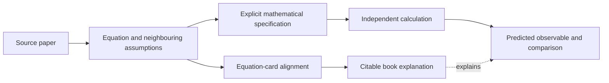

# Connecting a source equation to a checked transformation

A readable topic explanation, a relevant arXiv identifier and a worked
equation answer different questions. Citing that paper for the equation
requires locating its display and the assumptions around it. The book's
source index records which relations have such a witness.

For the two-spin calculation in this tutorial,
`build/construction_companion/quantum_correlations/input.json`
specifies $H=gZ\otimes Z$ and the measured $X\otimes I$. FieldBridge checks
the resulting observable closure from an authored benchmark. Its input has
no original-paper display. [The original-paper example](12_original_sources.md)
shows what a located equation and its surrounding assumptions add.

[`build_morphwiki_v2_quantum_evidence_index.py`](../../scripts/build_morphwiki_v2_quantum_evidence_index.py)
joins topic candidates to source-card evidence. The stricter
[`audit_morphwiki_v2_quantum_evidence_index.py`](../../scripts/audit_morphwiki_v2_quantum_evidence_index.py)
checks whether the topic's defining relation has a relevant equation witness.
Identifier-linked papers are recovery candidates; confirmed witnesses carry
the matching display and its local context.

Inspect the evidence index belonging to the book you intend to distribute.
An older local copy and a newer cluster build can have different coverage.
Keep the book, evidence index and reports from the same build together. Their
counts then refer to the same set of source relations.

## Evidence and calculation are separate branches

The source neighbourhood matters because a transformation may be defined in a
different display from either endpoint of an atlas edge. The edge locates
candidate equations; their relation is established by recovery and
calculation. A useful record
therefore includes the source display identifiers, domain and preparation
assumptions, state and observable maps, the relation to preserve, its computed
remainder, and the comparison with the essential term omitted.

FieldBridge's `construct --calculate` now connects a retrieved source record
to a supplied map or observable. Its adapter checks the record identifier and
the agreement of a typed annotation with the local canonical equation, then
emits and verifies the mathematical specification. The bundled records are
authored examples, identified as such in the output; original-paper alignment
requires the separate display and context check above.

The connections in `analyze_quantum_constructor_rewiring.py` are likewise
authored definitions. Its reports record their origin and use route overlap
to locate relevant topics. The equations are supplied with the definitions.

For a transfer between stochastic coordinates, the generator relation can be
checked by comparing the coefficients acting on arbitrary smooth test
functions. For the finite quantum example, closure is checked by matrix
identities. A hash identifies the stored input; the generator and observable
relations establish the calculated physical consequence.

## Interpretation of an unsuccessful transfer

A discrepancy is interpreted through the relation it was meant to preserve.
Numerical error decreases under suitable refinement. A transformed generator
can determine an omitted drift; repeated commutators can identify an
additional correlation. A correspondence whose domain or observable cannot
be matched is rejected. Each conclusion requires its own calculation.

A theory with curvature can predict nontrivial closed transport exactly. If
a reduced description predicts neutral transport for the same loop, the
difference locates structure omitted by that reduction. Testing this claim
requires composed maps on physical states and a measured transported
quantity.

The companion script calculates three authored benchmarks. Their inputs,
identities and controls accompany the explanation; the book's source index
continues to record its own equation witnesses.

## Assemble one complete record

For a stochastic map, retain the source SDE, interpretation of its noise,
coordinate domain and the proposed map. Link those inputs to their displays
and nearby definitions. The verifier can then calculate the target drift and
variance. Its zero residual belongs to that specification, while the source
alignment identifies where the specification came from.

For a finite quantum model, retain the Hamiltonian, tensor-product convention,
measured operator, units and allowed initial states. The closed expectation
equations then have an unambiguous physical interpretation. Two matrices with
identical entries but different basis conventions need not represent the same
measurement.

**Exercise.** Inspect a proposed cross-topic connection and mark which parts
are authored, which have equation witnesses, and which have executable checks.
Use those findings to decide the next action: recover a source, derive a map,
or test a prediction. Re-running the overlap score cannot substitute for the
missing action.

[Next: reproduce the calculation package](10_submission_companion.md) ·
[Tutorial](index.md)
