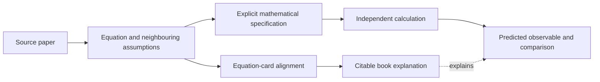

# Connecting a source equation to a checked transformation

A quantum topic can have a readable explanation, a relevant arXiv identifier
and a correct illustrative equation without that equation having been recovered
from the identified paper. These are different forms of evidence. The book's
source index should tell the reader which connection has actually been made.

[`build_morphwiki_v2_quantum_evidence_index.py`](../../scripts/build_morphwiki_v2_quantum_evidence_index.py)
joins topic candidates to source-card evidence. The stricter
[`audit_morphwiki_v2_quantum_evidence_index.py`](../../scripts/audit_morphwiki_v2_quantum_evidence_index.py)
checks whether the topic's defining relation has a relevant equation witness.
Identifier-linked candidates remain useful for recovery, but they cannot be
published as confirmed witnesses merely because their paper is accessible.

Inspect the evidence index belonging to the book you intend to distribute.
An older local copy and a newer cluster build can have different coverage.
Keep the book, evidence index and reports from the same build together;
neither a historical count nor a later completion message identifies the
contents of a different artifact.

## Evidence and calculation are separate branches

The source neighbourhood matters because a transformation may be defined in a
different display from either endpoint of an atlas edge. The edge is a locator;
the relation must be recovered and calculated separately. A useful record
therefore includes the source display identifiers, domain and preparation
assumptions, state and observable maps, the relation to preserve, its computed
remainder, and the comparison with the essential term omitted.

FieldBridge's `construct --calculate` now connects a retrieved source record
to a supplied map or observable. Its adapter checks the record identifier and
the agreement of a typed annotation with the local canonical equation, then
emits and verifies the mathematical specification. This local binding does
not establish alignment to an original paper. The bundled source records are
authored examples, and their status is retained in the calculation output.

The connections in `analyze_quantum_constructor_rewiring.py` are likewise
authored definitions. Its reports now state that origin and distinguish topic
availability from mathematical verification. A route-overlap score annotates
those definitions; it does not derive their equations.

For a transfer between stochastic coordinates, the generator relation can be
checked by comparing the coefficients acting on arbitrary smooth test
functions. For the finite quantum example, closure is checked by matrix
identities. A hash only proves which stored input was used. It does not prove
conservation, equivalence of evolutions or physical validity.

## Interpretation of an unsuccessful transfer

A discrepancy has to be interpreted within the specified relation. Numerical
error should decrease under a suitable refinement. An omitted drift may be
derived from the transformed generator. A reduced observable set may require
an additional correlation. A false correspondence may simply need to be
discarded. None of these outcomes can be selected from the magnitude of an
embedding distance alone.

Likewise, a nontrivial closed transport can be the correct prediction of a
complete theory with curvature. It becomes evidence of omitted structure
only relative to a smaller description that was claimed to reproduce that
transport. Noncommuting edits to stored text are not a measurement of physical
holonomy.

The companion script leaves the source-grounding status of the book unchanged.
Its three mathematical examples identify themselves as authored benchmarks.
Their exact calculations can accompany the explanation while the source-index
work proceeds, but they do not repair missing citations by relabelling examples.

Next: [reproduction and submission packaging](10_submission_companion.md).

## Assemble one complete record

For a stochastic map, retain the source SDE, interpretation of its noise,
coordinate domain and the proposed map. Link those inputs to their displays
and nearby definitions. The verifier can then calculate the target drift and
variance. Its zero residual belongs to that specification, while the source
alignment identifies where the specification came from.

For a finite quantum model, retain the Hamiltonian, tensor-product convention,
measured operator, units and allowed initial states. The closed expectation
equations then have an unambiguous physical interpretation. Two matrices with
identical entries but different basis conventions need not represent the same
measurement.

**Exercise.** Inspect a proposed cross-topic connection and mark which parts
are authored, which have equation witnesses, and which have executable checks.
Use those findings to decide the next action: recover a source, derive a map,
or test a prediction. Re-running the overlap score cannot substitute for the
missing action.

[Tutorial](index.md)
