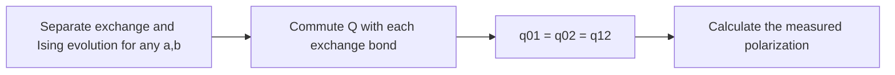

# From explaining a mechanism to constructing its interactions

The two-spin example starts with a Hamiltonian and finds the observables
needed to predict its motion. An inverse construction starts with a physical
requirement and asks which interactions satisfy it. FieldBridge now includes
a runnable example: preserve collective phase evolution in a spin chain while
the exchange strengths vary independently.

The derivation, input changes and source code are explained in the
[FieldBridge inverse-construction tutorial](https://github.com/synthetix-institute/fieldbridge/blob/main/docs/tutorial/14_inverse_construction.md).
MorphWiki can reproduce that calculation alongside the three existing
companion examples without regenerating the quantum book.

## Reproduce the four-example companion

Keep current checkouts of MorphWiki and FieldBridge next to each other. From
the MorphWiki root:

```bash
python3 -m pip install -e '../fieldbridge[construction]'
python3 -B scripts/build_construction_companion.py \
  --fieldbridge-root ../fieldbridge \
  --include-spin-design --out-dir build/construction_companion_with_design
```

A successful run reports four calculations. Open the output `README.md`,
then `spin_cancellation_design/design.md`. The adjacent `input.json` and
`design.json` preserve the supplied physical question and the calculated
result. The default command without `--include-spin-design` still runs the
original three examples.

## Follow the physical argument

For three spins, exchange has independent energies $a$ and $b$:

```math
H_0=a(X_0X_1+Y_0Y_1)+b(X_1X_2+Y_1Y_2).
```

The added interaction has unknown coefficients,
$Q=q_{01}Z_0Z_1+q_{02}Z_0Z_2+q_{12}Z_1Z_2$. To separate the exchange and
Ising evolutions for arbitrary $a,b$, the constructor sets the commutator
with each exchange bond to zero. Exact linear algebra gives
$q_{01}=q_{02}=q_{12}=\lambda$. Thus the relative couplings are calculated
from the requirement, while their overall energy scale remains free.



The arrows follow the calculation from the supplied commutation requirement
to the coupling coefficients and measured polarization. The preparation and
observable fix which polarization is predicted.

This interaction is $\lambda(M^2-3I)/2$, where $M=Z_0+Z_1+Z_2$ is conserved
by exchange. Its physical action is a phase evolution conditional on the
other spins. Preparing the first spin along $+x$ and the others maximally
mixed gives, with $r=\sqrt{a^2+b^2}$,

```math
\langle X_0(t)\rangle
=\frac{b^2+a^2\cos(2rt/\hbar)}{a^2+b^2}
 \cos^2(2\lambda t/\hbar).
```

The collective zeros occur at $(2m+1)\pi\hbar/(4|\lambda|)$ regardless of
the exchange energies. The builder checks the formula by full Hamiltonian
evolution. Changing one Ising coupling breaks a zero in the supplied example;
changing the exchange strengths preserves it.

Restricting the Ising interaction to neighbours sets $q_{02}=0$, which,
with the derived equalities, forces every coupling to zero. This commuting
construction therefore requires the longer-range $q_{02}$ coupling for a
nonzero Ising interaction.

## Explain what was constructed

The interaction coefficients follow from exact commutation equations. The
response additionally depends on a specified preparation and observable.
These dependencies explain why a topic description must retain more than
the Hamiltonian formula: a different preparation need not produce the same
phase average, and another observable need not have the same zeros.

The calculation uses a known collective-spin mechanism to demonstrate a
search procedure. A discovery study would impose a further physical
constraint, derive the interactions that satisfy it and compare their
predictions with established results. This command calculates the ideal
Hamiltonian; noise and pulse synthesis would enter a later realization study.

The four examples form a reproducible methods companion. The book retains its
own source citations, and this build writes only its selected output directory.

[Tutorial](index.md) | [Companion packaging](10_submission_companion.md)
