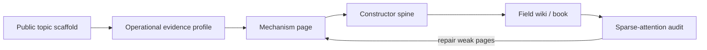

# Tutorial: Building a Mechanism-First Field Wiki

Traditional scientific wikis are organized around named objects, people,
disciplines and historical events. They are effective reference systems: a
reader can look up an electron, a wavefunction, a material or a theorem and
learn where the term came from and how it is normally described. That structure
does not necessarily show how the knowledge works. Topics that sit next to one
another may play different roles in a theory, while the same mathematical
operation may be scattered across distant fields under unrelated names.

MorphWiki rebuilds the sourced material around operational definitions. Each
topic is asked to state what carries the relevant state, what transformation
acts, which conditions make the construction admissible, what can be observed
and which procedure realizes the effect. The resulting wiki describes a field
as a system of mechanisms and dependencies rather than only as a catalogue of
objects.

This reorganization has three purposes. First, it explains a field through the
sequence of constructions needed to obtain its predictions. Second, it exposes
missing operators, closures, readouts and protocols that fluent topic prose can
hide. Third, it makes discoveries searchable: an operation established in one
field can be recognized in another carrier, and a partial mechanism can be
completed by following dependencies already supported elsewhere. Familiar
names and history remain available through the topic and provenance views; they
no longer determine the operational organization.

This tutorial follows the abstraction-and-relationship format of
[PocketFlow Tutorial Codebase Knowledge](https://github.com/The-Pocket/PocketFlow-Tutorial-Codebase-Knowledge).
It uses the existing quantum-theory build as a worked example and then shows
how the same contract applies to another field.



## Chapters

1. [Why a field needs more than a topic list](01_three_views.md)
2. [Build a source-grounded topic index](02_topic_and_evidence.md)
3. [Rewrite one topic as a mechanism](03_mechanism_page.md)
4. [Infer the field’s constructor spine](04_constructor_spine.md)
5. [Assemble and audit the field wiki](05_build_and_audit.md)
6. [Adapt MorphWiki to another field](06_new_field.md)

## Quick Start

```bash
git clone https://github.com/synthetix-institute/morphwiki.git
cd morphwiki
bash scripts/run_quantum_book.sh
```

Then open:

```text
discoveries/morphwiki_quantum/quantum_mechanism_tree.md
discoveries/morphwiki_quantum/derivation_pages/schr_dinger_equation.md
discoveries/morphwiki_quantum/book/quantum_mechanism_tree_book.pdf
```

The standard build works from cached evidence. An LLM is optional and may only
rewrite the supplied structured evidence; it must not invent mechanisms or
sources.
