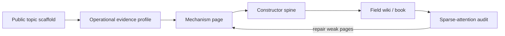

# Tutorial: Building a Mechanism-First Field Wiki

MorphWiki creates Wikipedia-style descriptions of scientific fields with a
different organizing principle. Familiar names remain searchable, but the
field is rebuilt around the mechanisms that make its theories predictive.

This tutorial follows the abstraction-and-relationship format of
[PocketFlow Tutorial Codebase Knowledge](https://github.com/The-Pocket/PocketFlow-Tutorial-Codebase-Knowledge).
It uses the existing quantum-theory build as a worked example and then shows
how the same contract applies to another field.



## Chapters

1. [Why a field needs more than a topic list](01_three_views.md)
2. [Build a source-grounded topic index](02_topic_and_evidence.md)
3. [Rewrite one topic as a mechanism](03_mechanism_page.md)
4. [Infer the field’s constructor spine](04_constructor_spine.md)
5. [Assemble and audit the field wiki](05_build_and_audit.md)
6. [Adapt MorphWiki to another field](06_new_field.md)

## Quick Start

```bash
git clone https://github.com/synthetix-institute/morphwiki.git
cd morphwiki
bash scripts/run_quantum_book.sh
```

Then open:

```text
discoveries/morphwiki_quantum/quantum_mechanism_tree.md
discoveries/morphwiki_quantum/derivation_pages/schr_dinger_equation.md
discoveries/morphwiki_quantum/book/quantum_mechanism_tree_book.pdf
```

The standard build works from cached evidence. An LLM is optional and may only
rewrite the supplied structured evidence; it must not invent mechanisms or
sources.
