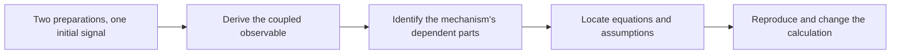

# MorphWiki tutorial

Start with an experiment: prepare two interacting spins and measure one spin's
transverse magnetization. The measured value at preparation does not determine
its later motion. The interaction also couples it to a correlation between the
spins. Finding that correlation connects state composition, Hamiltonian
evolution and measurement in one calculation.

The main path follows this measurement from physical question to calculation,
interpretation, source evidence and reproduction. It uses one two-spin example
throughout, so the notation gains a physical meaning before it is applied to
other theories.

## Learning path



1. [Start with the experiment](01_three_views.md). Two preparations can have
   the same measured magnetization at $t=0$ but different later signals.
   Identify the missing initial quantity before looking at a topic map.
2. [Derive the smallest closed prediction](08_quantum_construction.md).
   A commutator with the Hamiltonian produces a correlation; a second
   commutator returns to the measured operator. The diagram and equations
   show why two expectations suffice for this signal at nonzero coupling.
3. [Read the nested description](07_nested_dependencies.md). Map the state
   space, evolution, physical conditions, preparation and measurement onto
   the calculation just completed. Changing the measured operator then shows
   which parts of the prediction must change.
4. [Connect the equation to its evidence](09_sources_and_calculations.md).
   Follow the diagram from a source display and its nearby assumptions to a
   specified calculation. A correct calculation and a confirmed paper link
   answer different questions.
5. [Reproduce the results](10_submission_companion.md). Run the three supplied
   constructions and inspect their inputs, derived identities and omission
   controls. The optional [inverse construction](11_inverse_construction.md)
   then starts from a required response and solves for interactions.

The path uses the cached pages and a separate calculation build.

## First calculation

Use Python 3.10 or newer, with the standalone FieldBridge repository next to
MorphWiki. All commands below run from `morphwiki/`.

```bash
python3 -m venv .venv
source .venv/bin/activate
python3 -m pip install -e '../fieldbridge[construction]'
python3 -B scripts/build_construction_companion.py \
  --fieldbridge-root ../fieldbridge --out-dir build/construction_companion
```

Expected completion: `status: complete`, `calculations: 3`. Open
`build/construction_companion/README.md`, then the quantum calculation linked
there. It should report a four-dimensional Hilbert space and a closed
two-dimensional observable span.

After installation this run is offline. It needs no TeX engine and leaves the
book, cached topic pages and source index unchanged.

## Further modules

| To do this | Continue here |
| --- | --- |
| Trace a candidate paper to an original equation | [Topic evidence](02_topic_and_evidence.md) → [Original-paper recovery](12_original_sources.md) |
| Explain and regenerate a quantum chapter | [Mechanism page](03_mechanism_page.md) → [Topic placement](04_constructor_spine.md) → [Isolated rebuild](05_build_and_audit.md) |
| Start a wiki in another field | [New-field walkthrough](06_new_field.md) → [PDF workflow](../PDF_CORPUS_WORKFLOW.md) |
| Decide what accompanies a manuscript | [Submission scope](13_submission_scope.md) |
| Explore another physical question | [Material-memory path](topics/index.md), beginning with [writable states](topics/memory_dynamics.md) |

The source index locates an equation in a paper; the calculation input records
the equations supplied to a verifier. The three benchmarks are authored
examples with independently checked mathematical consequences.

For the stochastic derivation and retrieval software, use the
[FieldBridge tutorial](https://github.com/synthetix-institute/fieldbridge/blob/main/docs/tutorial/index.md).
