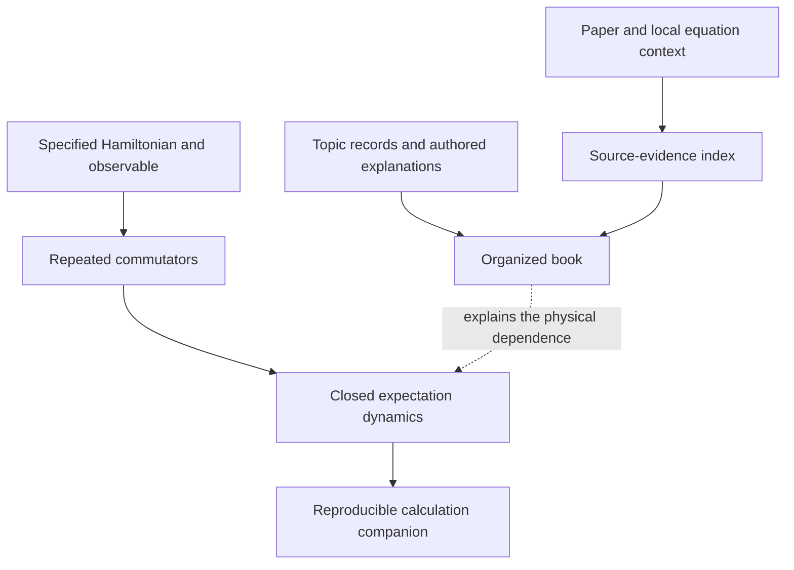

# MorphWiki tutorial

Start with an experiment: prepare two interacting spins and measure one spin's
transverse magnetization. The measured value at preparation does not determine
its later motion. The interaction also couples it to a correlation between the
spins. Finding that correlation connects state composition, Hamiltonian
evolution and measurement in one calculation.

You will read a mechanism page, see how the topic map is built, reproduce the
calculation, and learn how source evidence accompanies an explanation. The
last part shows how to begin a wiki for another field.

## Choose your route

| Purpose | Recommended path |
| --- | --- |
| Understand the physical idea | [Three views](01_three_views.md) → [One page](03_mechanism_page.md) → [Nested dependencies](07_nested_dependencies.md) → [Spin calculation](08_quantum_construction.md) |
| Reproduce calculations now | [Companion walkthrough](10_submission_companion.md) → [Spin calculation](08_quantum_construction.md) |
| Construct an interaction from a physical requirement | [Spin calculation](08_quantum_construction.md) → [Inverse construction](11_inverse_construction.md) |
| Maintain the quantum book | [Source records](02_topic_and_evidence.md) → [Topic placement](04_constructor_spine.md) → [Safe rebuild](05_build_and_audit.md) → [Evidence and calculation](09_sources_and_calculations.md) |
| Recover an original equation | [Original-paper recovery](12_original_sources.md) → [Safe rebuild](05_build_and_audit.md) |
| Work on another field | [New-field walkthrough](06_new_field.md) → [PDF workflow](../PDF_CORPUS_WORKFLOW.md) → [Evidence and calculation](09_sources_and_calculations.md) |

Chapter filenames remain unchanged for stable links. You do not need to
rebuild the book before trying a calculation.

## First successful run

Use Python 3.10 or newer, with the standalone FieldBridge repository next to
MorphWiki. All commands below run from `morphwiki/`.

```bash
python3 -m venv .venv
source .venv/bin/activate
python3 -m pip install -e '../fieldbridge[construction]'
python3 -B scripts/build_construction_companion.py \
  --fieldbridge-root ../fieldbridge --out-dir build/construction_companion
```

Expected completion: `status: complete`, `calculations: 3`. Open
`build/construction_companion/README.md`, then the quantum calculation linked
there. It should report a four-dimensional Hilbert space and a closed
two-dimensional observable span.

After installation this run is offline. It needs no TeX engine and leaves the
book, cached topic pages and source index unchanged.

## Two kinds of connection



The source index answers where an equation was found. The mathematical input
answers which equation was used. A research example needs both, but the
supplied benchmark calculations can be understood before a full source archive
is available.

For the stochastic derivation and retrieval software, use the
[FieldBridge tutorial](https://github.com/synthetix-institute/fieldbridge/blob/main/docs/tutorial/index.md).
