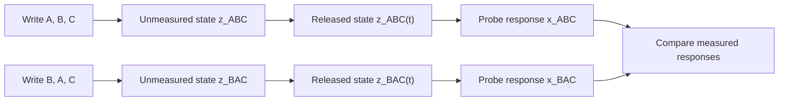

# Ordered memory in a material

The [double-well calculation](memory_dynamics.md) finds writable states and
the field that switches between them. The [carrier-transfer calculation](memory_transfer.md)
tests whether a proposed change of material preserves the dynamics. A memory
of an input sequence also depends on the order in which those inputs act and
on what a later measurement can resolve.

## 1. Writing, retention and measurement

A material-memory experiment applies inputs in sequence. To distinguish
their order from simple retention of the most recent input, compare the
histories $A,B,C$ and $B,A,C$. They end with the same write $C$ and can
have the same measured $x$ while leaving different unmeasured $z$. During a
field-free interval, the unmeasured difference must survive. A selective probe
then couples it to a measured response:



The two paths give a memory signal when release preserves a difference between
the written states and the probe converts it into distinct measured responses.
With initial state $q_0$, write operations $W_A,W_B,W_C$, field-free
evolution $\mathcal R_t$, selective probe $U$ and measured observable $R$,
order is retained in this experiment when

```math
R U\mathcal R_t W_CW_BW_A(q_0)
\ne R U\mathcal R_t W_CW_AW_B(q_0).
```

In the three-compartment example, symmetric free relaxation leaves
the outer imbalance invisible to the central population; a selective exchange
pulse makes that imbalance affect the central measurement. A direct measurement
of the unmeasured coordinate is a second possible measurement.

The physical state contains both $x$ and $z$. The write, release and probe
generators act on that state; preparation fixes its starting point and the
measured population defines the observable. A material realization supplies
the couplings, timescales and physical means of applying those operations.

## 2. Tests of a proposed realization

The KnowledgeParser protocol screen reads a specified realization's write
supports, release, measurement and control arms. It also identifies candidate
routes through geometric frustration or a slow internal field from the
supplied couplings and timescales.

In a local development checkout with `KnowledgeParser/` beside `morphwiki/`,
run from the MorphWiki root (with NumPy available):

```bash
python3 -B ../KnowledgeParser/scripts/run_material_memory_constructor.py \
  --spec-dir ../KnowledgeParser/results/material_memory_constructor_20260917/specs \
  --out-dir build/tutorial_memory_constructor
```

Open `build/tutorial_memory_constructor/report.md`. The current local sample
returns `design_admissible` for rotating colloids and `protocol_incomplete`
for active droplets and liquid-crystal torons, whose state-matched controls
are missing. An eligible route specifies a physical design and a
discriminating control. Retained-pattern measurements after release would test
its memory response. The rotating-colloid route
specifies a bond-frame coupling on a disordered graph, whereas the memory
measurement must compare the retained written pattern with controls after
the writing field is removed.

**Exercise.** In `report.md`, find the `state_matched_control` gate. If a
control changes both the bond-frame coupling and the system's global order,
why can a difference in retained overlap not be assigned uniquely to the
bond-frame interaction? The proposed comparison changes the intended coupling
or loop phase while keeping the measured order parameters matched.

The runner and specifications currently reside in the local KnowledgeParser
development checkout. The preceding [transfer module](memory_transfer.md)
uses its dynamical constructor to calculate model states and drift residuals;
the protocol screen here specifies the corresponding material comparison.

## 3. Memory and computation

Retention supplies a state that later inputs can act on. A material computation
also requires a task and a measured answer. Learning
requires a further change in the material's response law that improves its
performance on new inputs. The preliminary finite-model route is described
in `KnowledgeParser/docs/MATERIAL_COMPUTATION_CONSTRUCTOR.md`. Its adaptation
law is supplied in a finite model; a material implementation would require
that law to be measured.

[Previous: carrier transfer](memory_transfer.md) ·
[Topic paths](index.md) · [Main tutorial](../index.md)
