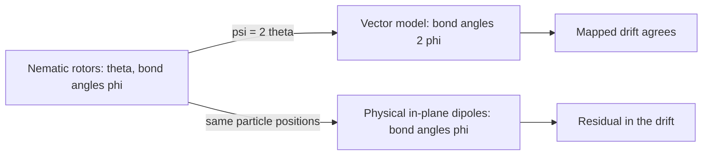

# Transfer a memory mechanism between carriers

The [double-well example](memory_dynamics.md) specifies a write and retention
mechanism on one coordinate. A transfer to another carrier must preserve the
relevant evolution, including its state map. Let $q$ be a source state with
drift $F_s(q)$, let $\alpha(q)$ map it to a target state, and let $F_t$ be the
target drift. The mapped source trajectory follows the target dynamics when

```math
F_t(\alpha(q))=D\alpha(q)F_s(q).
```

Here $D\alpha$ maps the source velocity into the target tangent space.
Different mobilities can be compared after a uniform rescaling of time;
the implementation fits that factor $c$ before evaluating
$F_t(\alpha(q))-cD\alpha(q)F_s(q)$ on sampled states. The transfer must
also map the preparation and measured pattern to make a claim about memory.
The current `Transfer.defect` calculation checks the deterministic drift on
sampled carrier states. A complete stochastic transfer also matches the
noise law, allowed states and observable under $\alpha$.

## A nematic-to-vector map

In the capillary-rotor model, each rod orientation $\theta$ has period
$\pi$. Doubling the angle gives a vector orientation $\psi=2\theta$ with
period $2\pi$. For an exact image of the model, the target interaction also
uses doubled bond angles and transformed mobility and noise. The resulting
drift satisfies the mapped evolution to numerical precision in the sampled
test.



At the original particle positions, in-plane point dipoles have different
angular and radial couplings. Doubling $\theta$ leaves the physical bond
angles at $\phi$, so the same state map leaves a drift residual. The
mathematical image identifies which interaction the transfer requires; the
dipole comparison tests whether that interaction is supplied by the proposed
realization.

With FieldBridge installed next to MorphWiki
(`python3 -m pip install -e '../fieldbridge[memory]'`):

```bash
python3 - <<'PY'
import numpy as np
from fieldbridge.memory import library, transfer
rods = library.rotor_patch("capillary")
rng = np.random.default_rng(20260923)
for target in (library.dipole_exact_map(rods), library.rotor_patch("dipolar")):
    print(target.name, transfer.double_angle(rods, target).defect(rng))
PY
```

The script prints the defect of the map for each target. The normalized
residual after time rescaling, `relative_defect_rescaled`, is below
$10^{-10}$ for the constructed vector image and about $0.82$ for dipoles at
the same positions. The latter number is a sampled diagnostic for the
specified patch and seed. The source map and residual calculation are in
`fieldbridge/memory/transfer.py`; the two target models are defined in
`library.py`.

## Loops constrain the available states

An interaction edge also maps one local preferred orientation to the next.
Composing those maps around a closed loop gives a return map $H$. A common
preferred state exists when $H$ has a fixed point. In the rotor models,
the loop can return as a rotation whose angle is set by the bond geometry;
a nonzero residual angle forces the interactions to compromise. In sign-valued
spin or gene loops, the corresponding return map is a product of bond signs.

`fieldbridge/memory/compose.py` calculates these loop maps and compares
their compatibility predictions with model states (`fieldbridge memory loops`,
FieldBridge tutorial, Module 3). Loop
incompatibility concerns which states are available. Their survival after
release is a separate dynamical calculation: barrier, noise and duration
determine retention. The [protocol module](memory_constructor.md) makes
that separation explicit in a proposed experiment.

**Exercise.** Compare the two printed defects. Which target changes the
bond geometry together with the orientation coordinate? Identify the
interaction and observable that a physical implementation would need to
reproduce the mapped memory experiment.

[Previous: find a writable state](memory_dynamics.md) ·
[Next: test ordered memory](memory_constructor.md)
